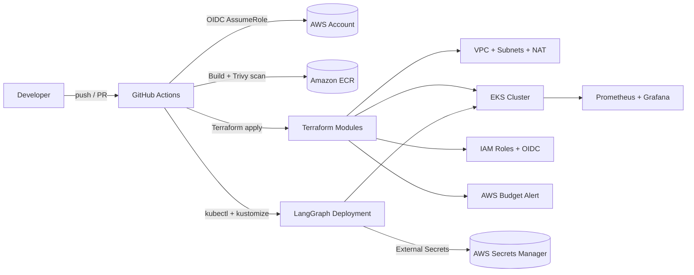

# Architecture

```mermaid
flowchart LR
  Dev[Developer] -->|push / PR| GH[GitHub Actions]
  GH -->|OIDC AssumeRole| AWS[(AWS Account)]
  GH -->|Build + Trivy scan| ECR[(Amazon ECR)]
  GH -->|Terraform apply| TF[Terraform Modules]
  TF --> VPC[VPC + Subnets + NAT]
  TF --> EKS[EKS Cluster]
  TF --> IAM[IAM Roles + OIDC]
  TF --> BGT[AWS Budget Alert]
  GH -->|kubectl + kustomize| APP[LangGraph Deployment]
  APP --> EKS
  APP -->|External Secrets| SM[(AWS Secrets Manager)]
  EKS --> OBS[Prometheus + Grafana]
```
